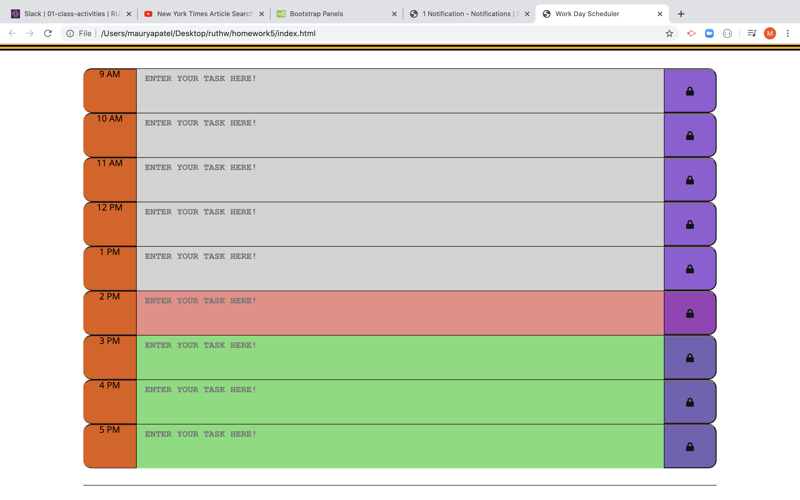
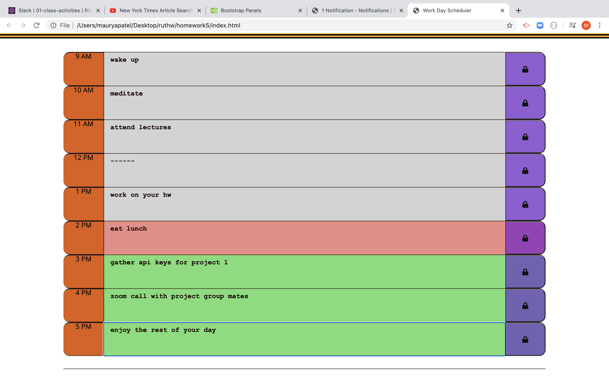

# homework5

# index.html

 In this file we will work on the basic template of the daily planner. 
I added rows and columns along with save buttons inside of the container that was provided to us. 
This helped me create 9 time slots for a 9-5 day. 

We added rows , columns and buttons inside those containers to make things more accessible for us

# style.css

 In this file we will figure out a way to make the daily planner look appealing by adding specific style elements to each row, time-block, button, etc. 
We started by tweaking the style.css file by changing the shape and radius of the rows and buttons and also by changing the color scheme! 

# script.js

In this file we implement a way to get real world time into our header using the moment.js libraray. 

 We also use local storage to store data in it and persist even when the page reloads. 

 Lastly we will dynamically color code the hour block based on the real world time. 

# Facilities used! 

 Moment.js 

 Bootstrap 

 Font Awesome 

 Google Fonts 

# link to the planner
https://maurya512.github.io/homework5/

# screenshot of the planner 

# screenshot of the planner at different hours
